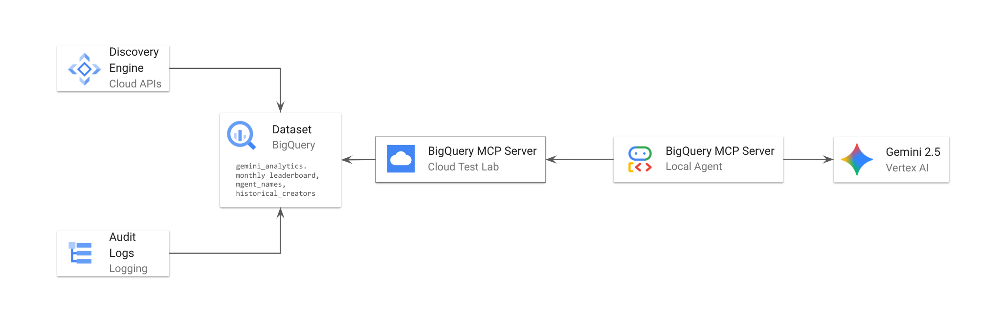
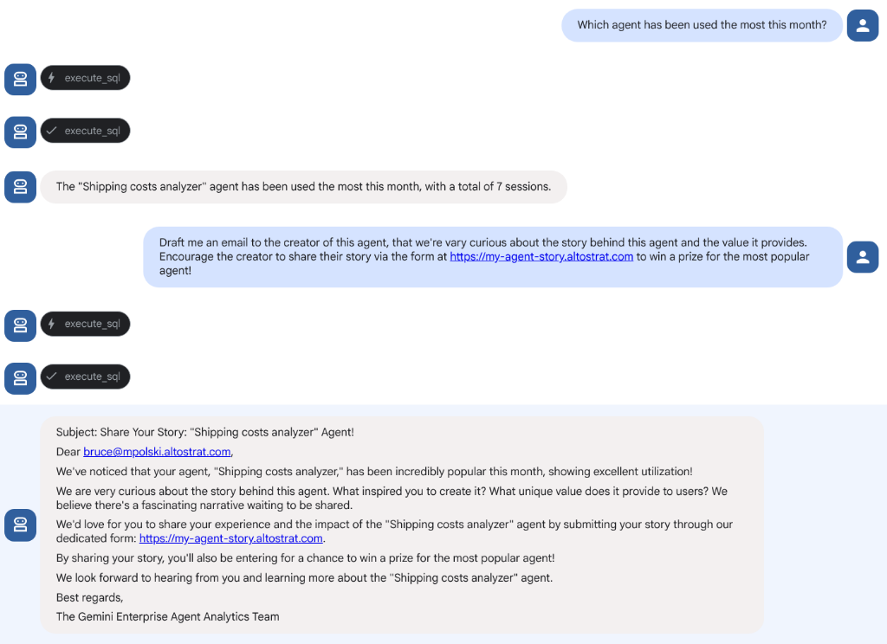

# Agents Creator Metrics

## Overview
This project provides a robust, automated pipeline to export analytics metrics from **Google Gemini Enterprise (Discovery Engine) Analytics** to **BigQuery**, while overcoming a native limitations in Gemini Enterprise Analytics while it's still in preview.

### The Problem
Currently, the native Gemini Enterprise Analytics UI lack two critical dimensions:
1. **Human-Readable Agent Names:** Data is only tracked against an opaque `Agent ID`, not the actual display name of the agent (e.g. "Shipping Cost Analyzer").
2. **Creator Accountability:** It is natively impossible to see *who* created an agent and *when* it was created directly within the analytics suite.

### The Solution
We solve this by actively combining data from the **Discovery Engine API** and Google Cloud **Audit Logs** to construct a unified analytics hub in BigQuery. Once the data is enriched and centralized in BigQuery, we deploy an **ADK-based conversational agent** to unlock the true potential of the data—allowing non-technical users to interact with and query these complex metrics entirely using native natural language.



---

## Phase 1: Data Pipeline & BigQuery Infrastructure

### Data Architecture
The data pipeline exports, enriches, and merges disparate data streams into three distinct tables stored within a single BigQuery dataset (default: `gemini_analytics`):

1. **`monthly_leaderboard`**
   - **Source:** Discovery Engine API (`exportMetrics`)
   - **Purpose:** Stores raw session and usage metrics (e.g., `agent_session_count`, `search_click_count`) grouped by `date` for activity reporting.
2. **`agent_names`**
   - **Source:** Discovery Engine API (Assistants/Agents enumeration)
   - **Purpose:** Maps opaque backend node IDs to human-readable agent `display_name`s.
3. **`historical_creators`**
   - **Source:** Google Cloud Audit Logs
   - **Purpose:** Maps agent IDs to their explicit creator email (`creator_email`) and creation `timestamp`.

*Note: We seamlessly join these tables in BigQuery by extracting the `agent_id` substring from the end of the `agent_name` column in the `monthly_leaderboard` table.*

### Infrastructure IAM & Security
When configuring the pipeline infrastructure, two core identities are used:

**1. The Operator (Your Local ADC)**
When executing setup scripts from your laptop via `gcloud auth application-default login`, you must have:
- **BigQuery Data Editor** (`roles/bigquery.dataEditor`)
- **Discovery Engine Viewer/Editor** (`roles/discoveryengine.viewer`)
- **Logs Configuration Writer / Viewer** (`roles/logging.configWriter`, `roles/logging.viewer`)
- **Project IAM Admin** (`roles/resourcemanager.projectIamAdmin`) required only for `setup_sink.sh`.

**2. The Log Sink Service Account**
Running `./setup_sink.sh` provisions a unique Writer Identity for the sink, automatically granting it **BigQuery Data Editor** to stream agent creations.

### Pipeline Setup & Installation (One-Time)

1. **Configure the Environment:**
   ```bash
   cp .env_template .env
   ```
   Define your active `PROJECT_ID`, engine info, and dataset specifications inside `.env`.

2. **Install Python Dependencies (using `uv`):**
   ```bash
   uv venv
   uv pip install -r requirements.txt
   ```

3. **Provision BigQuery (Dataset and Tables) & Create View:**
   Execute the startup script to create the dataset and base tables, then run the view creation script for easier querying:
   ```bash
   chmod +x deploy/start.sh
   ./deploy/start.sh
   
   chmod +x deploy/create_unified_view.sh
   ./deploy/create_unified_view.sh
   ```

4. **Provision Cloud Logging Sink (For Live Events):**
   Creates a live Logging Sink to stream *future* creations directly into BigQuery.
   ```bash
   chmod +x deploy/setup_sink.sh
   ./deploy/setup_sink.sh
   ```

### Data Ingestion & Sync

1. **One-Time Backfill of Historical Creators:**
   Scans past 365 days of Audit Logs to backfill `historical_creators`.
   ```bash
   chmod +x pipelines/export_historical_creators.sh
   ./pipelines/export_historical_creators.sh
   ```
   **NOTE:** This task will take serveral minutes to complete.

2. **Periodic Data Ingestion (Sync) - Unified Script:**
   Run the unified sync script to pull the latest display names and usage metrics from Vertex API and push them to BigQuery:
   ```bash
   chmod +x pipelines/sync_data.sh
   ./pipelines/sync_data.sh
   ```

**Operational Cadence (Scheduling):**
Recommendation: Run `./pipelines/sync_data.sh` nightly using your local scheduler or deploy it as a **Google Cloud Run Job** triggered by **Google Cloud Scheduler**.

---

## Phase 2: Local Analytics Agent (ADK)

Once the data is flowing into BigQuery, this repository provides a powerful, pre-configured **Vertex AI Agent** built with the Agent Development Kit (ADK) capable of chatting with this data natively using the BigQuery MCP.

### The Vision: Empowering Change Management
Imagine deploying this ADK agent to **Vertex AI Agent Engine** and sharing its natural-language conversational interface directly with your Change Management, Platform Adoption, or Executive teams. Instead of manually writing SQL queries or building complex dashboards, non-technical stakeholders can simply ask the agent about specific data insights.


### Running the Agent
For detailed instructions on configuring the local environment, provisioning the ADK service account, and testing this ADK agent locally, refer to the [ADK Agent documentation](./adk_agent/README.md).
